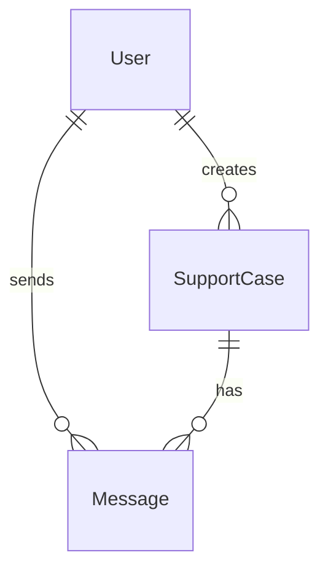

# <a href="https://github.com/dmarcoux/customer-chat">dmarcoux/customer-chat</a>

Imagine a situation where you need to implement a chat software for our
customer service to interact with our customers.

How would the quick win solution look like and how would the state-of-the-art
solution look like?

Implement a simple solution for a chat that enables customers to send
messages to customer service.

Talking points / topics to be considered:

- Which objects / classes would you create?
- How do they interact?
- How does the frontend interact with your classes?
- Which enhancements come to your mind when talking about chat software solutions?

## Quick Win Solution

### Architecture

- Monolith application built with Django
- SQLite as a database
- Models
    - User (Customer and Customer Agents)
    - Message
    - SupportCase



- Features
    - Messages aren't in real-time, the browser window must be refreshed
    - Customers can create multiple support cases
    - Customers can send messages in the support cases they created
    - Customer agents can send messages in all support cases

### Limitations

- Scalability
    - Every feature is part of the same application. What if one part of the application would benefit from having more resources?
    - SQLite scales well vertically, but it is hard to scale horizontally since a SQLite database is just a file on disk.
- Extensibility
    - Monolith application is simple to develop, but it's quite rigid.
    - User as the single model for customers and customer agents is fine at a small scale, but if this application grows, it would be better to
      split this model into 2 models (Customer, Customer Agent). It would be easier to understand what is specific to customers and customer agents.
    - It's possible for customers to open multiple support cases, but the support cases don't have any status (like "on going", "completed", etc...)
- Security / Data Privacy
    - Customer agents have access to all support cases. It would be better to assign one customer agent per support case
      to limit data access. In general, it's a questionable and risky practice to give everyone access
      to everything.
- Single point of failure
    - Since the application is hard to scale horizontally, thus most surely running on a single server, it has
      a single point of failure. If the server goes down (hardware failure, power outage, etc...), the application
      isn't usable anymore. The solution would be to address the scalability limitations. We are then able to
      remove this single point of failure by scaling horizontally with multiple application instances behind a
      load balancer, a database cluster with multiple read/write nodes
- Interactivity
    - Chat is not in real-time. Relying on an implementation based on WebSockets would fix this.
- Automation
    - It's possible that different customers ask the same questions. Whenever
      this happens, a customer agent must take their time to still reply what has
      already been said to a previous customer. It could be perhaps automated with
      AI.

## Python Development Environment with Nix Flakes

Reproducible development environment for Python projects which relies on
[Nix](https://github.com/NixOS/nix) [Flakes](https://nixos.wiki/wiki/Flakes),
a purely functional and cross-platform package manager.

**Start development environment:**

```bash
nix develop
```

**Create a virtual environment:**

```bash
python -m venv venv
```

**Activate the virtual environment:**

```bash
source venv/bin/activate
```

**Install dependencies:**

```bash
pip install -r requirements.txt
```

**Migrate the database:**

```bash
python manage.py migrate
```

**Create a super user for the admin interface:**

```bash
python manage.py createsuperuser
```

**Run the development server:**

```bash
python manage.py runserver
# Now accessible at http://localhost:8000, admin interface at http://localhost:8000/admin
```

**Deactivate the virtual environment:**

```bash
deactivate
```

**Freeze dependencies:**

```bash
pip freeze > requirements.txt
```
